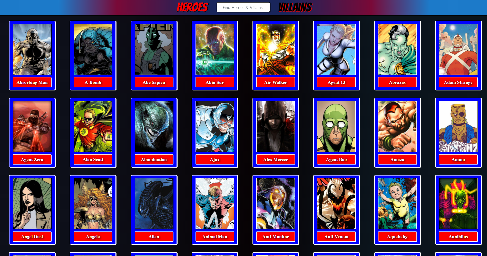
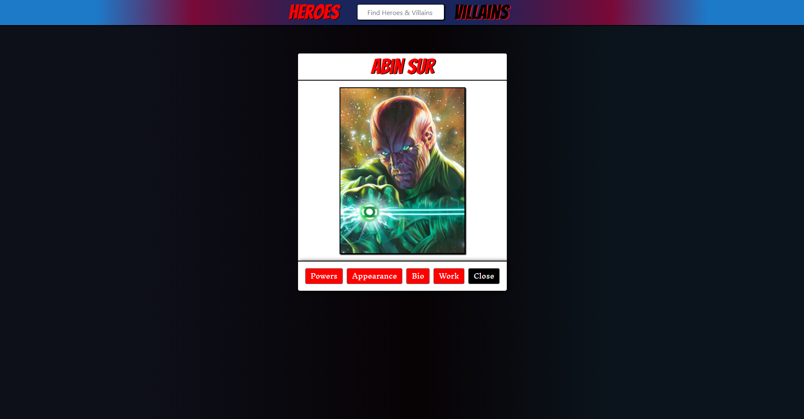
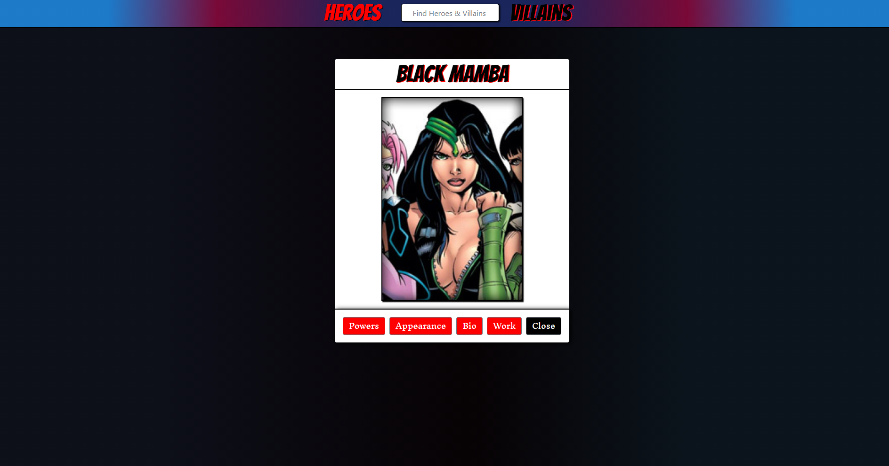
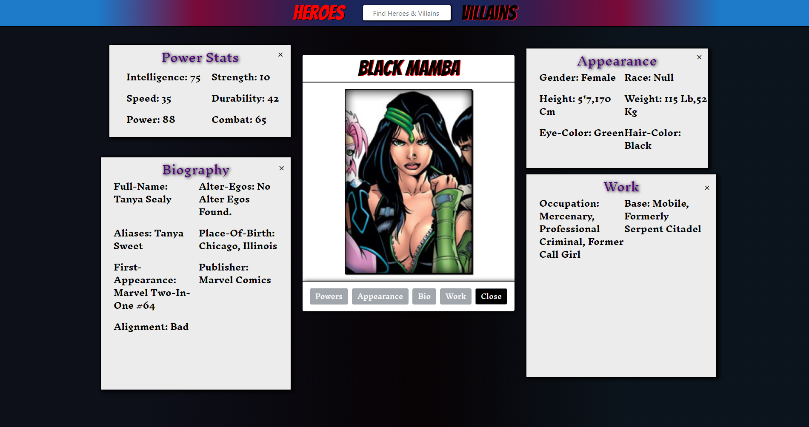

# heroes-and-villains
 
Web application built with HTML, CSS, and Javascript that loads character data from a third-party API and displays detailed data in modals and sub-modals.

##Screenshots
  
 
  
