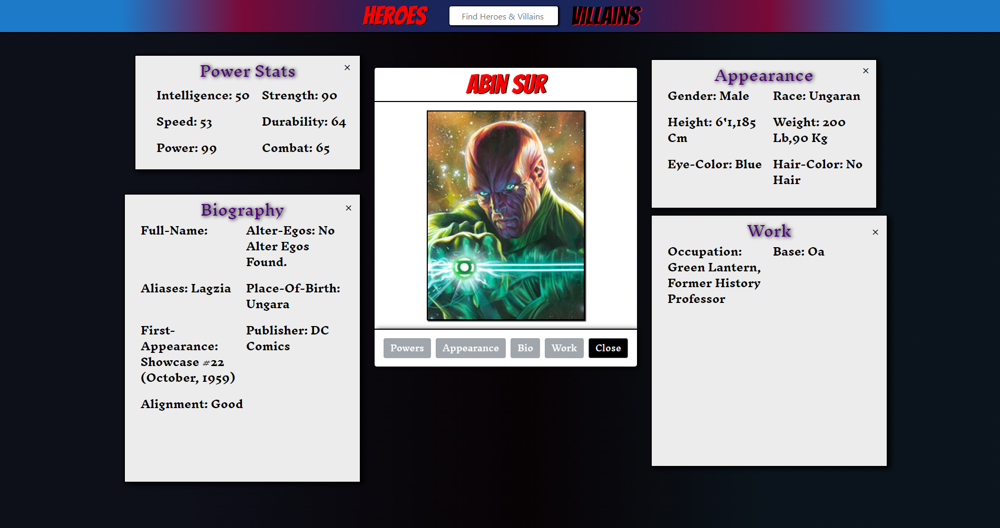

# Heroes & Villains
 
Web application built with HTML, CSS, and Javascript that loads character data from a third-party API and displays detailed data in modals and sub-modals.

## Screenshots
  

 
## Project Features

- Load data from an external API (https://superheroapi.com/).
- Display cards for all heroes and villains on main screen.
- User may search for specific characters in Navbar Search. 
- User clicks card button to display character modal containing name (red/hero or black/villain), larger image and 4 submodal buttons.
- The submodals display detailed data relative to character Powerstats, Biography, Appearance, and Work.
- App incorporates several CSS animations/transitions in Navbar, Main Card View, and Modal View.

## View Deployed Project

"https://akabab.github.io/superhero-api/
